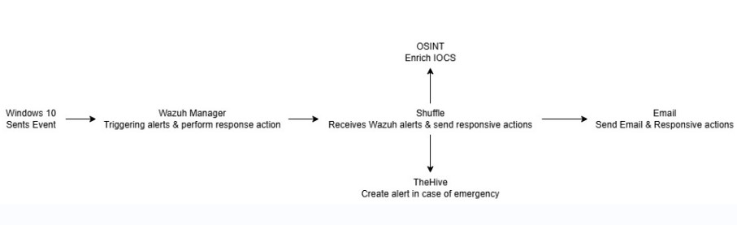

# Sentinel Shield 🛡️

An advanced Security Operations Center (SOC) automation framework that streamlines security event management, incident response, and threat intelligence enrichment through seamless integration using Wazuh, Shuffle, and TheHive. This project enhances incident response efficiency by automating event correlation, alerting, and response workflows. 


## 🌟 Features

- **Automated Event Processing**: Seamless collection and processing of security events from Windows 10 endpoints
- **Intelligent Alert Management**: Advanced alert correlation and prioritization through Wazuh Manager
- **OSINT Integration**: Automated threat intelligence enrichment via Shuffle
- **Real-time Response**: Automated incident response actions based on predefined playbooks
- **SOC Analyst Dashboard**: Intuitive interface for security analysts to monitor and manage incidents
- **TheHive Integration**: Automated case management and incident tracking
- **Email Notifications**: Automated alerting and reporting system

## 🏗️ Architecture

The project implements a multi-tier architecture with the following components:

1. **Event Collection Layer**
   - Windows 10 clients with Wazuh Agents
   - Event forwarding through secure channels

2. **Processing Layer**
   - Wazuh Manager for event correlation
   - Router for traffic management
   - Shuffle for OSINT enrichment and automation

3. **Response Layer**
   - TheHive for case management
   - Email notification system
   - Automated response actions

4. **Analysis Layer**
   - SOC Analyst interface
   - Reporting and visualization tools

## 🚀 Getting Started

### Prerequisites

- Windows 10 (for endpoints)
- Wazuh Manager
- Shuffle
- TheHive
- SMTP server for email notifications
- Python 3.8+

### ⚙️ Installation

1. Clone the repository
```bash
git clone https://github.com/Malik-0032/Sentinel-Shield-SOC-Automation.git
cd Sentinel-Shield-SOC-Automation
```

2. Configure the components
```bash
cp configs/wazuh/ossec.conf /var/ossec/etc/
cp configs/thehive/application.conf /etc/thehive/
```

3. Start the services
```bash
systemctl start wazuh-manager
systemctl start thehive
```

### 🔍Workflow



1. **Event Generation**: Windows 10 Wazuh Agent sends security events to Wazuh Manager.
2. **Alert Triggering**: Wazuh Manager generates alerts based on security policies.
3. **Alert Forwarding**: Wazuh Manager sends alerts to Shuffle.
4. **IOC Enrichment**: Shuffle queries OSINT sources to enrich IOCs.
5. **Alert Escalation**: Shuffle forwards enriched alerts to TheHive for case creation.
6. **Email Notification**: TheHive sends alert notifications to SOC analysts via email.
7. **Response Execution**: Shuffle triggers automated response actions based on predefined workflows.
8. **Incident Mitigation**: Wazuh Manager performs necessary actions on the affected endpoint.

## 🔒 Security Considerations

- All communications are encrypted using TLS 1.3
- Authentication required for all components
- Regular security audits recommended
- Principle of least privilege enforced

## 🤝 Contributing

1. Fork the repository
2. Create your feature branch (`git checkout -b feature/AmazingFeature`)
3. Commit your changes (`git commit -m 'Add some AmazingFeature'`)
4. Push to the branch (`git push origin feature/AmazingFeature`)
5. Open a Pull Request


---
⭐ Don't forget to star this repository if you find it useful!
